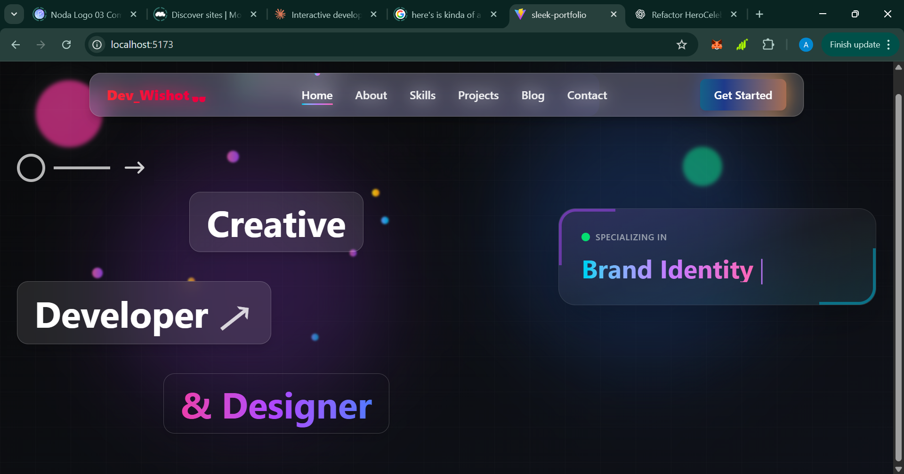

# 🚀 Analytical Wisdom — Developer Portfolio

Welcome to my personal developer portfolio!  
This project showcases my journey as a **software developer passionate about AI, modern web technologies, and interactive design**.  
It’s built to reflect my skillset through **clean architecture**, **smooth animations**, and a **modern developer aesthetic**.

---

## 🌟 Live Demo
🔗 [Visit My Portfolio] (Hang on)

---

## ✨ Key Features

| Feature | Description |
|----------|--------------|
| ⚡ **Responsive UI** | Adapts seamlessly to desktop, tablet, and mobile views |
| 🎨 **Modern Aesthetic** | Minimal, glassmorphic, and tech-inspired interface |
| 🧠 **Framer Motion** | Smooth animations and elegant menu transitions |
| 🧩 **Modular Components** | Each section (Navbar, About, Projects, Blog) is reusable and scalable |
| 🌙 **Dark Mode Ready** | A toggle-ready layout for modern UX standards |
| 💼 **Project Gallery** | Organized showcase of real-world projects and case studies |
| 🧰 **TypeScript Safety** | Strict typing ensures reliability and scalability |
| 🔍 **SEO Optimized** | Semantic HTML and meta-structure for better discoverability |

---

## 🧠 Tech Stack

| Category | Tools |
|-----------|-------|
| **Frontend Framework** | [React 18+](https://react.dev/) + [Vite](https://vitejs.dev/) |
| **Language** | [TypeScript](https://www.typescriptlang.org/) |
| **Styling** | [Tailwind CSS](https://tailwindcss.com/) |
| **Animations** | [Framer Motion](https://www.framer.com/motion/) |
| **Routing** | [React Router DOM](https://reactrouter.com/) |
| **State Management** | React Context API |
| **Deployment** | [Vercel](https://vercel.com/) / [Netlify](https://www.netlify.com/) |

---


---

## 🧩 Components Overview

- **Navbar / Sidebar** → responsive + animated with glassmorphic background  
- **Hero Section** → interactive intro text, call-to-action, and floating particles  
- **Projects Section** → showcases with motion hover effects and filters  
- **Skills Section** → tech stack with progress animations  
- **Blog Section** → structured and markdown-friendly  
- **Contact Section** → dynamic form, smooth scroll + social icons  

---

## 🏁 Getting Started

To run this project locally:

```bash
# 1. Clone the repo
git clone https://github.com/YOUR_USERNAME/portfolio-analytical-wisdom.git

# 2. Navigate into the directory
cd portfolio-analytical-wisdom

# 3. Install dependencies
npm install

# 4. Run the development server
npm run dev

# 5. Open http://localhost:5173 in your browser

| Command           | Description                         |
| ----------------- | ----------------------------------- |
| `npm run dev`     | Runs the app in development mode    |
| `npm run build`   | Builds the app for production       |
| `npm run preview` | Serves the production build locally |
| `npm run lint`    | Lints and checks TypeScript errors  |





